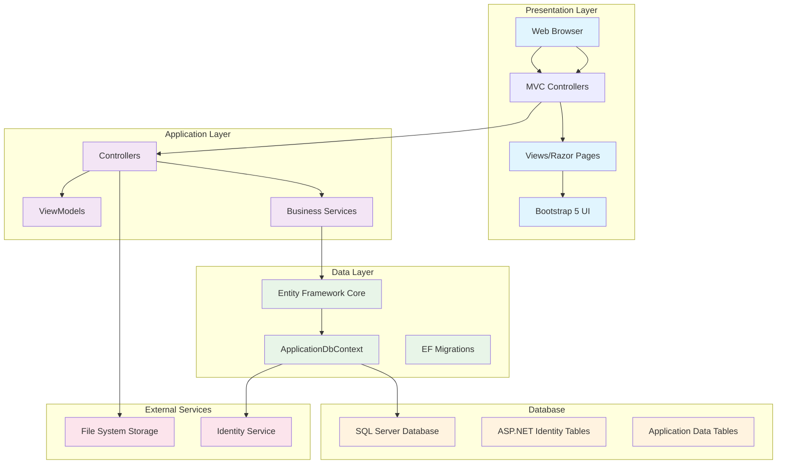
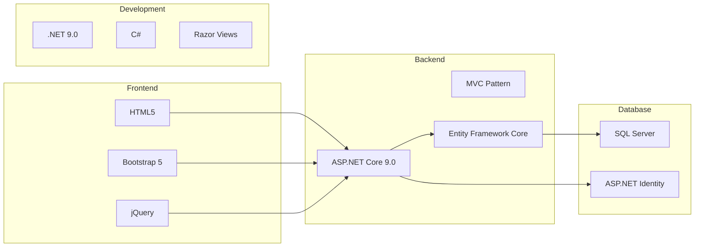
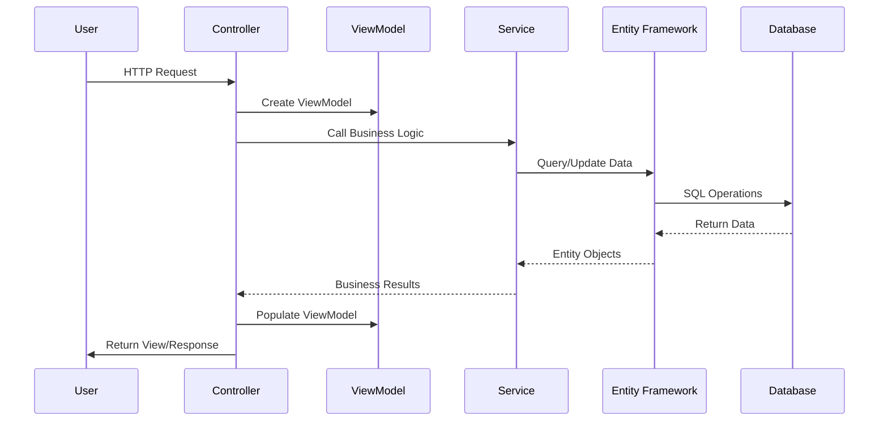
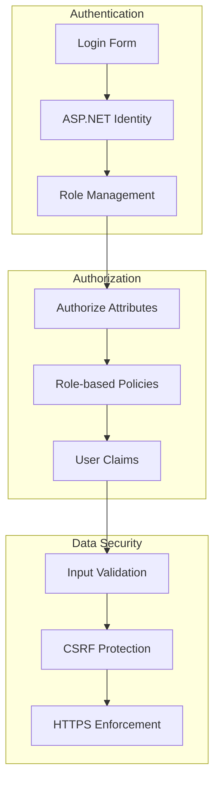
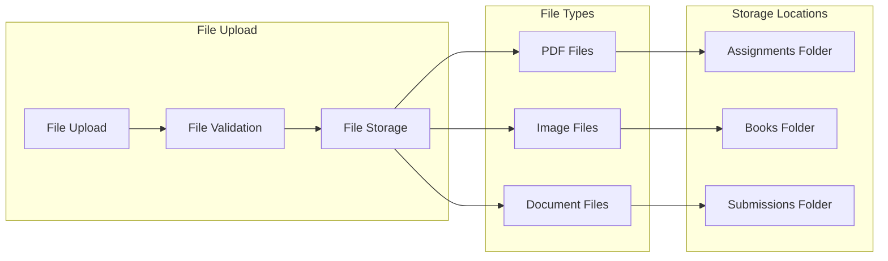

# Education Platform - System Architecture

## Architecture Components

### **1. Presentation Layer**
- **Web Browser**: Client-side interface
- **MVC Controllers**: Handle HTTP requests
- **Views**: Razor pages with Bootstrap 5
- **Static Assets**: CSS, JS, Images, Files

### **2. Application Layer**
- **Controllers**: 17 controllers handling different features
- **ViewModels**: 24 view models for data transfer
- **Business Logic**: Application services and validation

### **3. Data Layer**
- **Entity Framework Core**: ORM for database access
- **ApplicationDbContext**: Main database context
- **Migrations**: Database schema management

### **4. Database Layer**
- **SQL Server**: Primary database
- **Identity Tables**: User authentication/authorization
- **Application Tables**: Business data (Classes, Assignments, etc.)

### **5. External Services**
- **File System**: File storage for assignments/books
- **Identity Service**: User management and authentication

## Technology Stack

## Data Flow Architecture

## Security Architecture

## File Storage Architecture

## Key Features by Layer

### **Presentation Layer Features:**
- Responsive Bootstrap 5 UI
- Role-based navigation
- File upload interfaces
- Real-time notifications
- Exam taking interface

### **Application Layer Features:**
- Role-based authorization
- Business logic validation
- File processing
- Notification system
- Grade calculation

### **Data Layer Features:**
- Entity relationships
- JSON data storage
- Composite keys
- Cascade deletes
- Migration management

### **Database Layer Features:**
- User authentication
- Academic data management
- File metadata storage
- Audit trails
- Performance optimization 